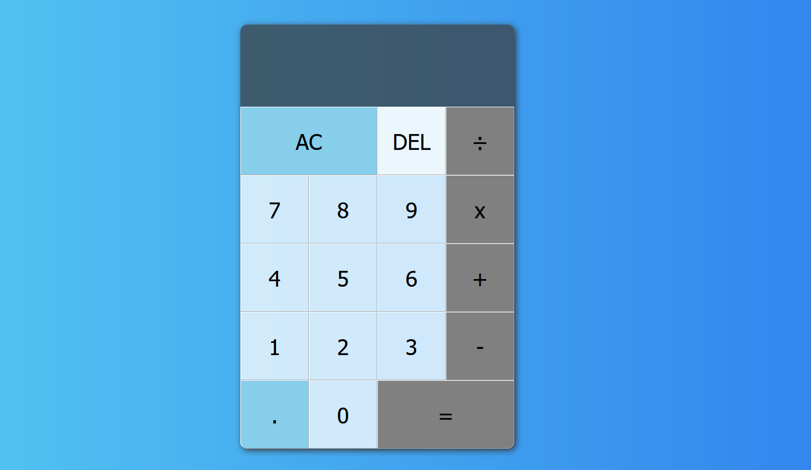
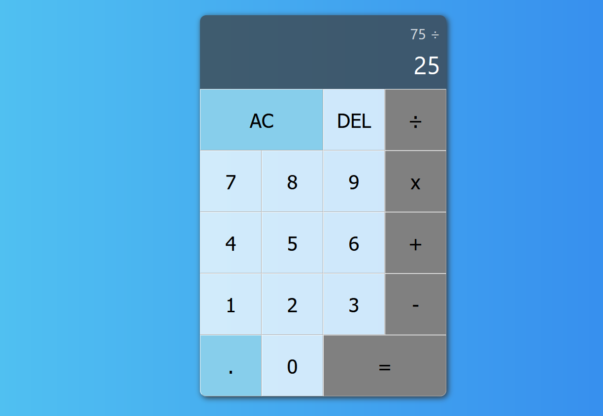

# How to use this project
- if you want compare code just explore code
- if you want to directly use just go to project path and type npm install
- after that run app with : # npm start
- your app will run on port 3000 http://localhost:3000

